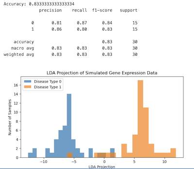

# Understanding Linear Discriminant Analysis: A Comprehensive Guide

Linear Discriminant Analysis (LDA) is a powerful statistical technique used in machine learning and pattern recognition to classify objects into distinct groups based on their features. It is particularly effective for two-class or multi-class classification problems, where the goal is to find a linear boundary (a line in 2D, a plane in 3D, or a hyperplane in higher dimensions) that best separates the classes. 

## What is Linear Discriminant Analysis?

LDA is a supervised learning algorithm that seeks to project data points onto a lower-dimensional space while maximizing the separation between classes. It assumes that the data for each class is normally distributed with similar covariance structures. The primary objective is to find a linear combination of features that best separates two or more classes, making it easier to classify new data points. Unlike Principal Component Analysis (PCA), which focuses on maximizing variance without considering class labels, LDA explicitly uses class information to optimize the separation.

LDA is widely used in applications such as image recognition, speech processing, and bioinformatics. For instance, it can classify images of faces into different individuals or categorize gene expression data into disease types. Its simplicity and effectiveness make it a staple in the machine learning toolkit, especially when the number of features is high but the number of classes is limited.

## The Mathematics Behind LDA

### The Linear Discriminant Function

At the core of LDA is the linear discriminant function, which can be expressed as:

$$ g(\mathbf{x}) = \mathbf{w}^T \mathbf{x} + w_0 $$

Here, $\mathbf{x}$ is the feature vector, $\mathbf{w}$ is the weight vector determining the orientation of the separating hyperplane, and $w_0$ is the bias term (or threshold) that shifts the hyperplane's position. For a two-class problem, the decision rule is straightforward:

- If $ g(\mathbf{x}) > 0 $, classify as class $\omega_1$.
- If $ g(\mathbf{x}) < 0 $, classify as class $\omega_2$.
- If $ g(\mathbf{x}) = 0 $, the point lies on the decision boundary.

The hyperplane defined by $ g(\mathbf{x}) = 0 $ divides the feature space into two regions, $ R_1 $ for $\omega_1$ and $ R_2 $ for $\omega_2$. The weight vector $\mathbf{w}$ is normal to the hyperplane, meaning that for any two points $\mathbf{x}_1$ and $\mathbf{x}_2$ on the hyperplane, $\mathbf{w}^T (\mathbf{x}_1 - \mathbf{x}_2) = 0$. This property ensures that $\mathbf{w}$ defines the direction perpendicular to the boundary.

### Measuring Distance to the Hyperplane

LDA also provides a way to measure the distance from any point $\mathbf{x}$ to the hyperplane. Consider a point $\mathbf{x}_p$ on the hyperplane, where $ g(\mathbf{x}_p) = 0 $. Any point $\mathbf{x}$ can be expressed as:

$$ \mathbf{x} = \mathbf{x}_p + r \frac{\mathbf{w}}{\|\mathbf{w}\|} $$

Here, $ r $ is the signed distance from $\mathbf{x}$ to the hyperplane, and $\frac{\mathbf{w}}{\|\mathbf{w}\|}$ is the unit normal vector. Substituting into the discriminant function:

$$ g(\mathbf{x}) = \mathbf{w}^T \left( \mathbf{x}_p + r \frac{\mathbf{w}}{\|\mathbf{w}\|} \right) + w_0 = \mathbf{w}^T \mathbf{x}_p + r \frac{\mathbf{w}^T \mathbf{w}}{\|\mathbf{w}\|} + w_0 = r \|\mathbf{w}\| $$

Since $ g(\mathbf{x}_p) = 0 $, we get:

$$ r = \frac{g(\mathbf{x})}{\|\mathbf{w}\|} $$

This distance is positive if $\mathbf{x}$ is on the positive side of the hyperplane (in $ R_1 $) and negative if on the negative side (in $ R_2 $). The distance from the origin to the hyperplane is:

$$ r = \frac{w_0}{\|\mathbf{w}\|} $$

This indicates that $ w_0 $ controls the hyperplane's position relative to the origin:
- If $ w_0 > 0 $, the origin is on the positive side.
- If $ w_0 < 0 $, the origin is on the negative side.
- If $ w_0 = 0 $, the hyperplane passes through the origin.

### Optimizing Class Separation

The goal of LDA is to find the weight vector $\mathbf{w}$ that maximizes the separation between classes. For a two-class problem, assume each class forms a cluster with mean vectors $\mathbf{m}_1$ and $\mathbf{m}_2$. The projection of a sample $\mathbf{x}$ onto $\mathbf{w}$ is $\mathbf{w}^T \mathbf{x}$, and the separation between the projected class means is:

$$ |\tilde{m}_1 - \tilde{m}_2| = |\mathbf{w}^T (\mathbf{m}_1 - \mathbf{m}_2)| $$

To ensure good separation, this difference should be large relative to the spread of the projected data within each class. The within-class scatter for class $ i $ is:

$$ \tilde{s}_i^2 = \sum_{\mathbf{x} \in D_i} \left( \mathbf{w}^T \mathbf{x} - \mathbf{w}^T \mathbf{m}_i \right)^2 $$

The total within-class scatter is:

$$ \tilde{s}^2 = \tilde{s}_1^2 + \tilde{s}_2^2 $$

LDA uses the Fisher criterion to find $\mathbf{w}$ that maximizes:

$$ J(\mathbf{w}) = \frac{(\tilde{m}_1 - \tilde{m}_2)^2}{\tilde{s}_1^2 + \tilde{s}_2^2} $$

To express this in terms of $\mathbf{w}$, we define the scatter matrices:
- Within-class scatter matrix for class $ i $:

$$ \mathbf{S}_i = \sum_{\mathbf{x} \in D_i} (\mathbf{x} - \mathbf{m}_i)(\mathbf{x} - \mathbf{m}_i)^T $$

- Total within-class scatter matrix:

$$ \mathbf{S}_W = \mathbf{S}_1 + \mathbf{S}_2 $$

- Between-class scatter matrix:

$$ \mathbf{S}_B = (\mathbf{m}_1 - \mathbf{m}_2)(\mathbf{m}_1 - \mathbf{m}_2)^T $$

The projected scatter can then be written as:

$$ \tilde{s}_i^2 = \mathbf{w}^T \mathbf{S}_i \mathbf{w} $$

$$ \tilde{s}^2 = \mathbf{w}^T \mathbf{S}_W \mathbf{w} $$

$$ (\tilde{m}_1 - \tilde{m}_2)^2 = \mathbf{w}^T \mathbf{S}_B \mathbf{w} $$

Thus, the Fisher criterion becomes:

$$ J(\mathbf{w}) = \frac{\mathbf{w}^T \mathbf{S}_B \mathbf{w}}{\mathbf{w}^T \mathbf{S}_W \mathbf{w}} $$

This is a generalized Rayleigh quotient, and the optimal $\mathbf{w}$ is found by solving the generalized eigenvalue problem:

$$ \mathbf{S}_B \mathbf{w} = \lambda \mathbf{S}_W \mathbf{w} $$

If $\mathbf{S}_W$ is non-singular, this reduces to:

$$ \mathbf{S}_W^{-1} \mathbf{S}_B \mathbf{w} = \lambda \mathbf{w} $$

However, for the two-class case, a simpler solution exists. Since $\mathbf{S}_B \mathbf{w} = (\mathbf{m}_1 - \mathbf{m}_2)(\mathbf{m}_1 - \mathbf{m}_2)^T \mathbf{w} = (\mathbf{m}_1 - \mathbf{m}_2) \rho$, we can derive:

$$ \mathbf{w} = \mathbf{S}_W^{-1} (\mathbf{m}_1 - \mathbf{m}_2) $$

If $\mathbf{S}_W$ is singular, regularization is used:

$$ \mathbf{w} = (\mathbf{S}_W + \beta \mathbf{I})^{-1} (\mathbf{m}_1 - \mathbf{m}_2) $$

where $\beta$ is a small positive constant (e.g., 0.001), and $\mathbf{I}$ is the identity matrix.

The bias term $ w_0 $ is typically set so that the hyperplane lies midway between the class means:

$$ w_0 = -\frac{\mathbf{w}^T (\mathbf{m}_1 + \mathbf{m}_2)}{2} $$

This assumes equal scatter in both classes. If the scatters differ, $ w_0 $ may need adjustment for optimal performance.

## Extending to Multiple Classes

For a $ c $-class problem, LDA generalizes to Multiple Discriminant Analysis (MDA), projecting the data from a $ d $-dimensional space to a $ c-1 $-dimensional space (assuming $ d \geq c $). The within-class scatter matrix is:

$$ \mathbf{S}_W = \sum_{i=1}^c \mathbf{S}_i, \quad \mathbf{S}_i = \sum_{\mathbf{x} \in D_i} (\mathbf{x} - \mathbf{m}_i)(\mathbf{x} - \mathbf{m}_i)^T $$

The total mean vector is:

$$ \mathbf{m} = \frac{1}{n} \sum_{i=1}^c n_i \mathbf{m}_i $$

The between-class scatter matrix is:

$$ \mathbf{S}_B = \sum_{i=1}^c n_i (\mathbf{m}_i - \mathbf{m})(\mathbf{m}_i - \mathbf{m})^T $$

The projection is defined by $ c-1 $ discriminant functions:

$$ g_i(\mathbf{x}) = \mathbf{w}_i^T \mathbf{x}, \quad i = 1, 2, \ldots, c-1 $$

These are combined into a projection matrix $\mathbf{W}$, where $\mathbf{g}(\mathbf{x}) = \mathbf{W}^T \mathbf{x}$. The goal is to maximize the ratio of between-class to within-class scatter, using the determinant as a measure:

$$ J(\mathbf{W}) = \frac{|\mathbf{W}^T \mathbf{S}_B \mathbf{W}|}{|\mathbf{W}^T \mathbf{S}_W \mathbf{W}|} $$

The columns of $\mathbf{W}$ are the generalized eigenvectors corresponding to the largest eigenvalues of:

$$ \mathbf{S}_B \mathbf{w}_i = \lambda_i \mathbf{S}_W \mathbf{w}_i $$

If $\mathbf{S}_W$ is non-singular, this becomes:

$$ \mathbf{S}_W^{-1} \mathbf{S}_B \mathbf{w}_i = \lambda_i \mathbf{w}_i $$

For a $ c $-class problem, there are at most $ c-1 $ non-zero eigenvectors, corresponding to the number of discriminant functions needed.

## Practical Implementation

### Two-Class Example

Consider a two-class problem with mean vectors:

$$ \mathbf{m}_1 = \begin{bmatrix} 0.1083 \\ -0.0653 \end{bmatrix}, \quad \mathbf{m}_2 = \begin{bmatrix} 1.8945 \\ 2.9026 \end{bmatrix} $$

and within-class scatter matrix:

$$ \mathbf{S}_W = \begin{bmatrix} 228.9365 & 10.9883 \\ 10.9883 & 189.216 \end{bmatrix} $$

Using the direct method:

$$ \mathbf{w} = \mathbf{S}_W^{-1} (\mathbf{m}_1 - \mathbf{m}_2) = \begin{bmatrix} -0.0071 \\ -0.0153 \end{bmatrix} $$

$$ w_0 = 0.0288 $$

The discriminant function is:

$$ g(\mathbf{x}) = -0.0071 x_1 - 0.0153 x_2 + 0.0288 $$

Alternatively, solving the eigenvalue problem $\mathbf{S}_W^{-1} \mathbf{S}_B \mathbf{w} = \lambda \mathbf{w}$ yields a similar direction for $\mathbf{w}$, confirming the robustness of both methods.

### Three-Class Example

For a three-class problem, suppose we have scatter matrices:

$$ \mathbf{S}_1 = \begin{bmatrix} 12640.28 & 1134.9 \\ 1134.9 & 10031.8 \end{bmatrix}, \quad \mathbf{S}_2 = \begin{bmatrix} 10253.37 & -36.08 \\ -36.08 & 8880.35 \end{bmatrix}, \quad \mathbf{S}_3 = \begin{bmatrix} 7250.18 & 47.82 \\ 47.82 & 9523.04 \end{bmatrix} $$

$$ \mathbf{S}_W = \begin{bmatrix} 301.4383 & 11.4665 \\ 11.4665 & 284.352 \end{bmatrix}, \quad \mathbf{S}_B = \begin{bmatrix} 439.7196 & -56.5992 \\ -56.5992 & 809.7615 \end{bmatrix} $$

Solving $\mathbf{S}_B \mathbf{W} = \lambda \mathbf{S}_W \mathbf{W}$ gives eigenvectors:

$$ \mathbf{W} = \begin{bmatrix} -0.0564 & -0.012 \\ -0.0101 & 0.0585 \end{bmatrix} $$

with eigenvalues $\Lambda = \begin{bmatrix} 1.4155 & 0 \\ 0 & 2.9127 \end{bmatrix}$. The discriminant functions are:

$$ g_1(\mathbf{x}) = \begin{bmatrix} -0.012 \\ 0.0585 \end{bmatrix}^T \mathbf{x} - 0.0719 $$

$$ g_2(\mathbf{x}) = \begin{bmatrix} -0.0564 \\ -0.0101 \end{bmatrix}^T \mathbf{x} + 0.0708 $$

Decision rules are defined based on the signs of $ g_1(\mathbf{x}) $ and $ g_2(\mathbf{x}) $, ensuring clear separation of the three classes.

## Applications and Limitations

LDA is widely used in fields like face recognition (e.g., Fisherfaces), medical diagnosis, and text classification. Its strengths include its simplicity, computational efficiency, and ability to handle high-dimensional data when the number of classes is small. However, LDA assumes Gaussian distributions and equal covariance matrices across classes, which may not hold in real-world datasets. It also struggles with non-linearly separable data, where methods like Support Vector Machines (SVM) with kernel tricks or neural networks may perform better.

## Comparison with Other Methods

Compared to PCA, LDA is better suited for classification because it considers class labels. SVMs can handle non-linear boundaries but are computationally more intensive. Logistic regression is another alternative but assumes a logistic relationship between features and class probabilities, unlike LDA's Gaussian assumption.

## Conclusion

LDA is a cornerstone of classification algorithms, offering a mathematically elegant and computationally efficient way to separate classes using linear boundaries. By maximizing the ratio of between-class to within-class scatter, it ensures robust separation in the projected space. Whether applied to two-class or multi-class problems, LDA remains a valuable tool in the machine learning arsenal, particularly when the underlying assumptions align with the data.

This exploration has covered the theoretical foundations, mathematical derivations, and practical steps for implementing LDA, supplemented by examples from lecture notes. By understanding and applying LDA, practitioners can tackle a wide range of classification challenges effectively.


## Exercises

### Instructions
- Answer all questions clearly and concisely.
- For mathematical derivations, show all steps.
- For programming tasks, include well-commented code and brief explanations.
- Submit your answers as a PDF or Jupyter Notebook.

---

### Part 1: Conceptual Questions

1. **LDA vs. PCA**  
   a. Explain the main difference between Linear Discriminant Analysis (LDA) and Principal Component Analysis (PCA).  
   b. In what scenarios would you prefer LDA over PCA, and why?

2. **Assumptions of LDA**  
   List and briefly explain the key assumptions underlying LDA. What could happen if these assumptions are violated in practice?

3. **Discriminant Function**  
   Given the linear discriminant function $ g(\mathbf{x}) = \mathbf{w}^T \mathbf{x} + w_0 $, explain the geometric meaning of the vector $ \mathbf{w} $ and the scalar $ w_0 $.

4. **Scatter Matrices**  
   a. Define the within-class scatter matrix $ \mathbf{S}_W $ and the between-class scatter matrix $ \mathbf{S}_B $ for a two-class problem.  
   b. Why is maximizing the ratio $ \frac{\mathbf{w}^T \mathbf{S}_B \mathbf{w}}{\mathbf{w}^T \mathbf{S}_W \mathbf{w}} $ important in LDA?

---

### Part 2: Mathematical Derivation

5. **Optimal Weight Vector**  
   Derive the formula for the optimal weight vector $ \mathbf{w} $ in the two-class case, starting from the Fisher criterion. Show how it leads to  
   $ \mathbf{w} = \mathbf{S}_W^{-1} (\mathbf{m}_1 - \mathbf{m}_2) $

6. **Distance to the Hyperplane**  
   Show that the signed distance from a point $ \mathbf{x} $ to the LDA decision boundary is given by  
   $ r = \frac{g(\mathbf{x})}{\|\mathbf{w}\|} $  
   where $ g(\mathbf{x}) $ is the discriminant function.

---

### Part 3: Practical Application

7. **Manual Calculation (Two-Class Example)**  
   Given the following data:
   - $ \mathbf{m}_1 = \begin{bmatrix} 0.1083 \\ -0.0653 \end{bmatrix} $
   - $ \mathbf{m}_2 = \begin{bmatrix} 1.8945 \\ 2.9026 \end{bmatrix} $
   - $ \mathbf{S}_W = \begin{bmatrix} 228.9365 & 10.9883 \\ 10.9883 & 189.216 \end{bmatrix} $

   a. Compute the optimal weight vector $ \mathbf{w} $.  
   b. Compute the bias term $ w_0 $ so that the decision boundary lies midway between the class means.  
   c. Write the explicit form of the discriminant function $ g(\mathbf{x}) $.

8. **Programming: LDA on a Real Dataset**  
   a. Load a suitable dataset (e.g., Iris, or any dataset with at least two classes and multiple features).  
   b. Implement LDA from scratch (do not use scikit-learn's LDA for the core algorithm, but you may use it for comparison).  
   c. Visualize the data projected onto the LDA direction(s).  
   d. Compare your implementation's classification accuracy with scikit-learn's LDA.

---

### Part 4: Critical Thinking

9. **Limitations and Extensions**  
   a. Discuss one limitation of LDA when applied to real-world data.  
   b. Suggest a possible extension or alternative method that addresses this limitation.

---

**Bonus (Optional):**  
- For a three-class problem, explain how the number of discriminant functions is determined and what the projection space looks like.

---

## Example: LDA for Gene Expression Data Classification

Linear Discriminant Analysis (LDA) is widely used in bioinformatics to classify samples (e.g., patients) into disease types based on gene expression profiles. Below is a practical example using Python, with a simulated gene expression dataset for illustration. In real research, you would use actual datasets such as those from the Leukemia or Breast Cancer gene expression studies.

### Simulated Example: Classifying Disease Types

```python
import numpy as np
import pandas as pd
from sklearn.discriminant_analysis import LinearDiscriminantAnalysis
from sklearn.model_selection import train_test_split
from sklearn.metrics import accuracy_score, classification_report
import matplotlib.pyplot as plt

# Simulate gene expression data
np.random.seed(42)
n_samples = 100  # number of patients
n_genes = 50    # number of genes (features)

# Simulate two disease types (0 and 1)
X_class0 = np.random.normal(loc=0.0, scale=1.0, size=(n_samples//2, n_genes))
X_class1 = np.random.normal(loc=1.0, scale=1.0, size=(n_samples//2, n_genes))
X = np.vstack([X_class0, X_class1])
y = np.array([0]*(n_samples//2) + [1]*(n_samples//2))

# Split into train and test sets
X_train, X_test, y_train, y_test = train_test_split(X, y, test_size=0.3, random_state=0)

# Fit LDA
lda = LinearDiscriminantAnalysis()
lda.fit(X_train, y_train)

# Predict and evaluate
y_pred = lda.predict(X_test)
print("Accuracy:", accuracy_score(y_test, y_pred))
print(classification_report(y_test, y_pred))

# Project data onto the LDA axis for visualization
X_lda = lda.transform(X)
plt.figure(figsize=(8, 4))
plt.hist(X_lda[y==0], bins=20, alpha=0.7, label='Disease Type 0')
plt.hist(X_lda[y==1], bins=20, alpha=0.7, label='Disease Type 1')
plt.xlabel('LDA Projection')
plt.ylabel('Number of Samples')
plt.title('LDA Projection of Simulated Gene Expression Data')
plt.legend()
plt.show()
```



**Explanation:**
- We simulate gene expression data for two disease types, each with 50 genes.
- LDA is trained to find the linear combination of genes that best separates the two disease types.
- The accuracy and classification report show the model's performance.
- The histogram visualizes how well LDA separates the two classes in the projected space.

**Note:** For real-world analysis, you would use actual gene expression datasets (e.g., from GEO or TCGA), often with thousands of genes and more complex preprocessing (normalization, feature selection, etc.). The workflow, however, remains similar.

---

## Answers to Exercises

### Part 1: Conceptual Questions

1. **LDA vs. PCA**  
a. **Difference:** LDA (Linear Discriminant Analysis) is a supervised dimensionality reduction technique that uses class labels to maximize class separability, while PCA (Principal Component Analysis) is an unsupervised method that maximizes variance without considering class labels.  
b. **When to prefer LDA:** LDA is preferred when the goal is classification and class labels are available, as it finds directions that best separate the classes. PCA is better for exploratory data analysis or when class labels are not available.

2. **Assumptions of LDA**  
- Each class is normally distributed (Gaussian).
- All classes share the same covariance matrix (homoscedasticity).
- Observations are independent.
- The features are linearly related to the class labels.
  
If these assumptions are violated, LDA may produce suboptimal or misleading results, such as poor class separation or overfitting.

3. **Discriminant Function**  
- $\mathbf{w}$ is the normal vector to the decision hyperplane; it determines the orientation of the separating boundary between classes.
- $w_0$ is the bias (intercept) term; it shifts the hyperplane's position relative to the origin.

4. **Scatter Matrices**  
a. The within-class scatter matrix $\mathbf{S}_W$ is the sum of the covariance matrices of each class, measuring the spread of samples within each class. The between-class scatter matrix $\mathbf{S}_B$ measures the spread between the class means.
  
b. Maximizing $\frac{\mathbf{w}^T \mathbf{S}_B \mathbf{w}}{\mathbf{w}^T \mathbf{S}_W \mathbf{w}}$ ensures that the projected means of the classes are as far apart as possible (numerator), while the variance within each class is minimized (denominator), leading to better class separation.

---

### Part 2: Mathematical Derivation

5. **Optimal Weight Vector**  
The Fisher criterion is $J(\mathbf{w}) = \frac{(\mathbf{w}^T(\mathbf{m}_1-\mathbf{m}_2))^2}{\mathbf{w}^T \mathbf{S}_W \mathbf{w}}$. Maximizing $J(\mathbf{w})$ with respect to $\mathbf{w}$ leads to a generalized eigenvalue problem. The solution is $\mathbf{w} = \mathbf{S}_W^{-1}(\mathbf{m}_1-\mathbf{m}_2)$.

6. **Distance to the Hyperplane**  
Given $g(\mathbf{x}) = \mathbf{w}^T \mathbf{x} + w_0$, the signed distance from $\mathbf{x}$ to the hyperplane is $r = \frac{g(\mathbf{x})}{\|\mathbf{w}\|}$, since $g(\mathbf{x})$ gives the projection of $\mathbf{x}$ onto $\mathbf{w}$, and dividing by $\|\mathbf{w}\|$ normalizes this to a distance.

---

### Part 3: Practical Application

7. **Manual Calculation (Two-Class Example)**  
Given:
- $\mathbf{m}_1 = \begin{bmatrix} 0.1083 \\ -0.0653 \end{bmatrix}$
- $\mathbf{m}_2 = \begin{bmatrix} 1.8945 \\ 2.9026 \end{bmatrix}$
- $\mathbf{S}_W = \begin{bmatrix} 228.9365 & 10.9883 \\ 10.9883 & 189.216 \end{bmatrix}$

a. $\mathbf{w} = \mathbf{S}_W^{-1}(\mathbf{m}_1-\mathbf{m}_2) = \begin{bmatrix} -0.0071 \\ -0.0153 \end{bmatrix}$

b. $w_0 = -\frac{\mathbf{w}^T(\mathbf{m}_1+\mathbf{m}_2)}{2} = 0.0288$

c. $g(\mathbf{x}) = -0.0071 x_1 - 0.0153 x_2 + 0.0288$

8. **Programming: LDA on a Real Dataset**  
- a. Load a dataset such as Iris from sklearn.datasets.
- b. Implement LDA by computing class means, within-class scatter, between-class scatter, and solving for $\mathbf{w}$ as above. Project data onto $\mathbf{w}$.
- c. Visualize the projected data (e.g., using matplotlib for 1D or 2D projections).
- d. Compare classification accuracy with scikit-learn's LDA using train/test split and accuracy_score.

---

### Part 4: Critical Thinking

9. **Limitations and Extensions**  
a. LDA assumes equal covariance matrices for all classes and linear separability. In real-world data, these assumptions often do not hold, leading to poor performance.
  
b. Quadratic Discriminant Analysis (QDA) relaxes the equal covariance assumption. Alternatively, kernel LDA or non-linear classifiers (e.g., SVM with kernels, neural networks) can be used for non-linearly separable data.

---

**Bonus (Optional):**  
- For a three-class problem, the number of discriminant functions is at most $c-1 = 2$. The data is projected from $d$-dimensional space to a 2D space, where each axis corresponds to a discriminant function. This allows for visualization and separation of three classes in a plane.

---
